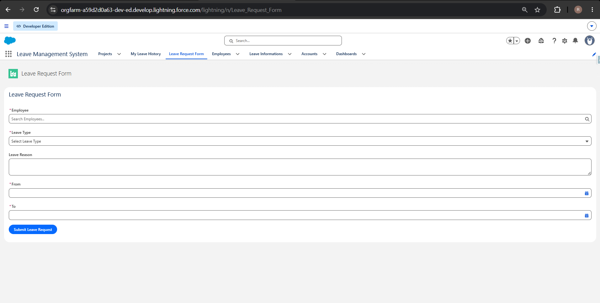
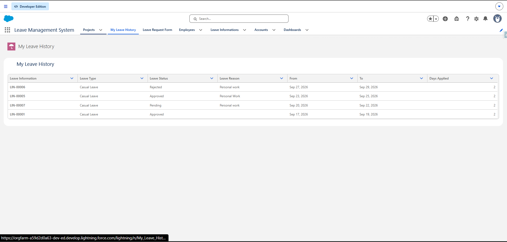
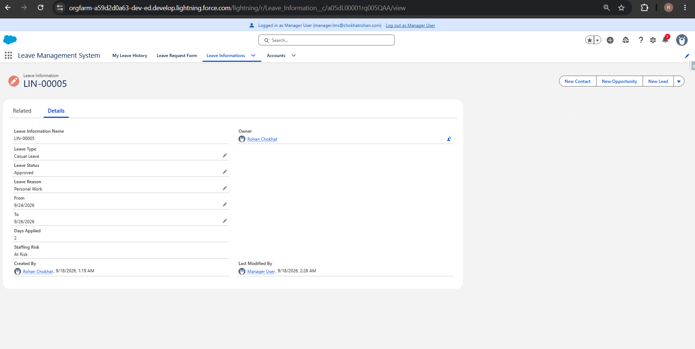
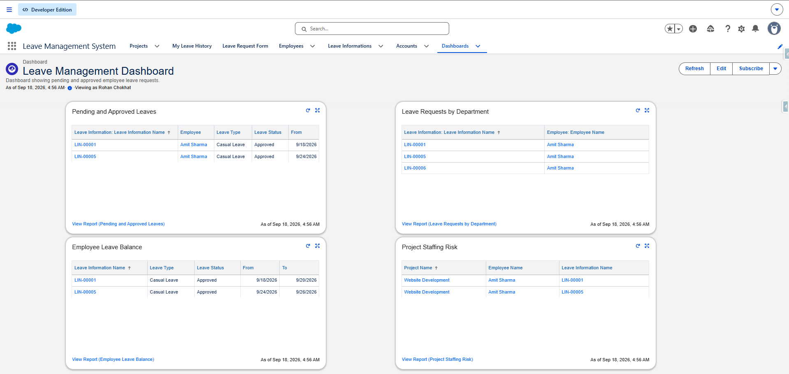
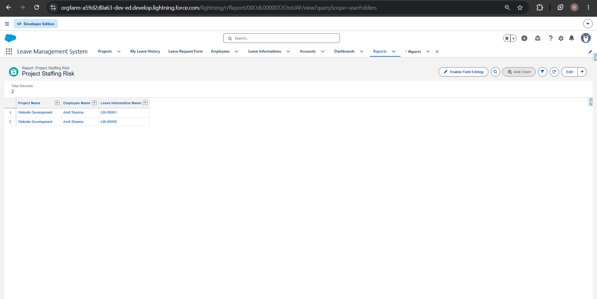

# Leave Management System — Salesforce

A Salesforce-based Leave Management System developed to manage employee leave requests, manager approvals, notifications, leave history, and workforce reporting.

## Project Overview

The Leave Management System provides a centralized Salesforce solution for managing employee leave requests and tracking their status.

The system includes custom Salesforce objects, validation rules, approval processes, record-triggered flows, Apex triggers, Lightning Web Components (LWC), reports, and dashboards.

## Key Features

- Employee leave request management
- Leave date and duration validation
- Sick leave reason validation
- Manager approval and rejection workflow
- Email notification after leave approval/rejection
- Prevention of overlapping leave requests
- Protection against deleting approved/completed leave requests
- Lightning Web Component for submitting leave requests
- Lightning Web Component for viewing leave history
- Department-wise leave reporting
- Employee leave balance reporting
- Project staffing risk reporting
- Salesforce dashboard for leave management

## Salesforce Data Model

### Project

The Project object stores project-related information.

Key fields include:

- Project Name
- Project Code
- Account
- Start Date
- End Date
- Status
- Active

### Employee

The Employee object stores employee information.

Key fields include:

- Employee Name
- Employee ID
- Salary
- Designation
- Project
- Email
- Department

### Leave Information

The Leave Information object stores employee leave requests.

Key fields include:

- Employee
- Leave Type
- Leave Status
- Leave Reason
- From Date
- To Date
- Days Applied
- Staffing Risk

## Automation

### Validation Rules

Implemented validations for:

- End Date must not be before Start Date
- Leave requests cannot exceed 15 days
- Sick Leave requires a Leave Reason

### Record-Triggered Flow

A Project record-triggered flow automatically manages the Active field based on Project Status.

- New → Active
- In Progress → Active
- On Hold → Active
- Completed → Inactive
- Closed → Inactive

### Approval Process

A Manager Approval Process is implemented for leave requests.

Workflow:

1. Employee submits a leave request
2. Leave request enters Pending status
3. Manager reviews the request
4. Manager approves or rejects the request
5. Leave status is updated accordingly

### Email Notification Flow

A record-triggered flow sends an email to the employee when a leave request is:

- Approved
- Rejected

## Apex Development

### LeaveOverlapTrigger

Prevents an employee from creating a leave request that overlaps with an existing leave request.

Error message:

> Overlapping leave is not allowed for the same employee.

### LeaveDeleteProtectionTrigger

Prevents deletion of leave requests when their status is:

- Approved
- Completed

Error message:

> Approved or Completed leave requests cannot be deleted.

### LeaveRequestController

An Apex controller used by the Leave Request Form LWC to create leave requests.

### MyLeaveHistoryController

An Apex controller used by the My Leave History component to retrieve leave history.

## Lightning Web Components

### Leave Request Form

A custom Lightning Web Component for submitting leave requests.

Features:

- Employee selection
- Leave Type selection
- Leave Reason
- From Date
- To Date
- Client-side validation
- Leave request submission

### My Leave History

A Lightning Web Component that displays leave request information including:

- Leave Request
- Employee
- Leave Type
- Leave Status
- Leave Reason
- From Date
- To Date
- Days Applied

## Reports

The project includes the following reports:

### Pending and Approved Leaves

Displays employee leave requests with Pending and Approved statuses.

### Leave Requests by Department

Displays leave requests grouped by employee department.

### Employee Leave Balance

Displays approved leave information and summarizes Days Applied for each employee.

### Project Staffing Risk

Identifies approved leaves that overlap with the employee's project duration.

## Dashboard

### Leave Management Dashboard

The dashboard provides an overview of the leave management system using the project reports.

Dashboard components include:

- Pending and Approved Leaves
- Leave Requests by Department
- Employee Leave Balance
- Project Staffing Risk

## Screenshots

### Leave Request Form



### My Leave History



### Manager Approval



### Leave Management Dashboard



### Project Staffing Risk



## Technologies Used

- Salesforce Platform
- Apex
- SOQL
- Lightning Web Components (LWC)
- Salesforce Flows
- Approval Processes
- Validation Rules
- Reports
- Dashboards
- Salesforce CLI
- Visual Studio Code
- Git
- GitHub

## Project Structure

```text
LeaveManagementSystem/
│
├── force-app/
│   └── main/
│       └── default/
│           ├── classes/
│           │   ├── LeaveRequestController.cls
│           │   └── MyLeaveHistoryController.cls
│           │
│           ├── lwc/
│           │   ├── leaveRequestForm/
│           │   └── myLeaveHistory/
│           │
│           └── triggers/
│               ├── LeaveOverlapTrigger.trigger
│               └── LeaveDeleteProtectionTrigger.trigger
│
├── config/
├── scripts/
├── screenshots/
├── package.json
├── sfdx-project.json
└── README.md